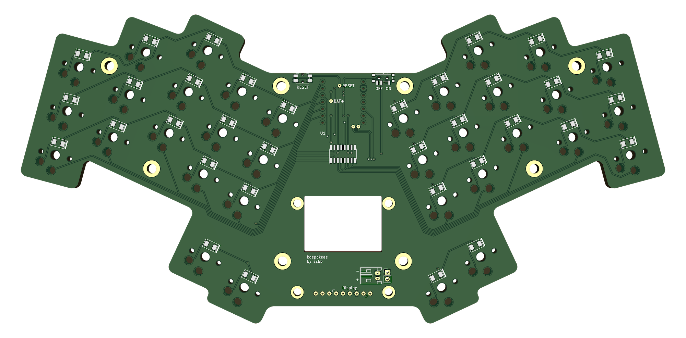

# koepckeae

## BOM

| Qty | Name            | Source                                                                                                             |
|-----|-----------------|--------------------------------------------------------------------------------------------------------------------|
| 1   | PCB             | [gerbers](pcb/choc/koepckeae_gerbers.zip)                                                                          |
| 1   | XIAO nRF52840   | [seed studio](https://www.seeedstudio.com/Seeed-XIAO-BLE-nRF52840-p-5201.html)                                     |
| 1   | 74HC595D        | [LCSC](https://www.lcsc.com/product-detail/Shifting-Register_Nexperia-74HC595D-118_C5947.html)                     |
| 1   | Power Switch    | [LCSC](https://www.lcsc.com/product-detail/Slide-Switches_C-K-PCM12SMTR_C221841.html)                              |
| 1   | Reset Button    | [LCSC](https://www.lcsc.com/product-detail/_PANASONIC-_C79174.html)                                                |
| 34  | 1N4148W diode   | [LCSC](https://www.lcsc.com/product-detail/Switching-Diode_MDD-Microdiode-Electronics-1N4148W_C84367.html)         |
| 2   | Pogo Pins       | [Digikey](https://www.digikey.com/en/products/detail/mill-max-manufacturing-corp/0906-2-15-20-75-14-11-0/1147050)  |
| 2   | MCU sockets     | [Digikey](https://www.digikey.com/en/products/detail/mill-max-manufacturing-corp/310-43-107-41-001000/1212181)     |
| 1   | Battery socket  | [LCSC](https://www.lcsc.com/product-detail/Wire-To-Board-Wire-To-Wire-Connector_JST-S2B-PH-K-S-LF-SN_C173752.html) |
| 34  | Hotswap Sockets | [Aliexpress](https://aliexpress.com/item/33023283633.html?sku_id=10000000883911874)                                |

### Plate case

| Qty | Name         | Source                                                             |
|-----|--------------|--------------------------------------------------------------------|
| 1   | Bottom Plate | [gerbers](mechanical/bottom-plate/bottom_plate_gerbers.zip)        |
| 8   | Solder Nuts  | [LCSC](https://www.lcsc.com/product-detail/_Sinhoo-_C2916384.html) |
| 8   | M2x5 screws  |                                                                    |

### Display

| Qty | Name                                                       | Source                                                                                                         |
|-----|------------------------------------------------------------|----------------------------------------------------------------------------------------------------------------|
| 1   | Adafruit Sharp Memory Display                              | [Adafruit](https://www.adafruit.com/product/3502)                                                              |
| 1   | 1 x 5 Mill-Max Spring Loaded Header (825-22-005-10-001101) | [Digikey](https://www.digikey.com/en/products/detail/mill-max-manufacturing-corp/825-22-005-10-001101/6149696) |
| 4   | M2.5x6 male-female nylon standoff                          | [Aliexpress](https://aliexpress.com/item/32871403400.html?sku_id=10000002420611426)                            |
| 4   | M2.5 nylon nut                                             | [Aliexpress](https://aliexpress.com/item/32868992270.html?sku_id=10000010058105677)                            |
| 4   | M2.5x6 nylon screw                                         | [Aliexpress](https://aliexpress.com/item/32870030598.html?sku_id=10000002668418327)                            |
